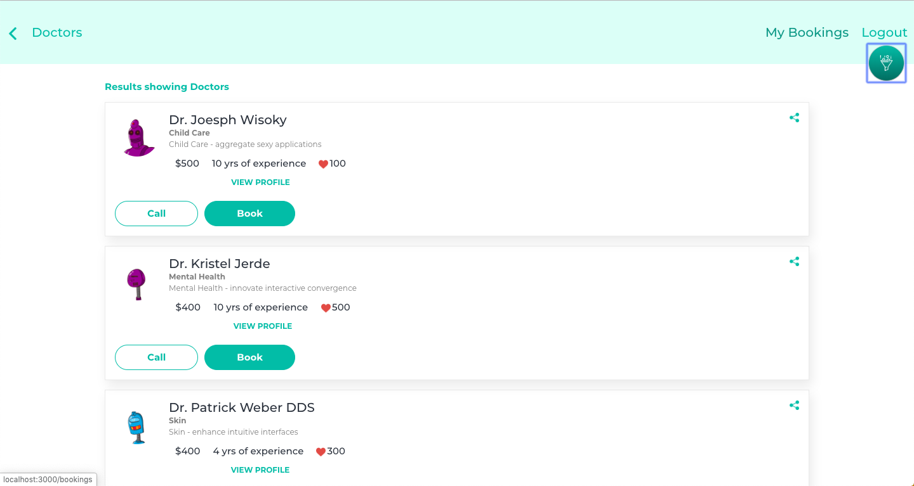

# [Doctorly](https://doctorly-official.herokuapp.com/)



## Table of content

- [Description](#description)
- [Installation](#installation)
- [Contact](#contact)
- [Backend](#backend)

## Description

This is a capstone project I built to graduate at Microverse. Here are the project [reuirements](https://www.notion.so/Final-Capstone-Project-Doctor-appointments-9b345aad940b4f0a951049fcb3da159f)

The design is taken from [here](https://www.behance.net/gallery/77208667/MediCo-Medical-mobile-app-UIUX-design)
Design credit goes to [Vinisha Panjikar](https://www.behance.net/vinishapanjikar)

[Live Link](https://doctorly-official.herokuapp.com/)

## Installation

1. Clone the project to your local directory

```
git clone https://github.com/KaushikShivam/doctor-react
```

2. Run npm install to install the required dependencies

3. Run `npm run start`

## Backend

This project uses Rails API for the backend. Here's the [link for the repo](https://github.com/KaushikShivam/doctor_api)

## Contact

You can contact me at:

- [Email](shivamkaushikofficial@gmail.com)
- [Linkedin](https://www.linkedin.com/in/shivam-kaushik-bb8162102/)
- [Twitter](https://twitter.com/kShivamDev)
- [Medium](https://medium.com/@shivamkaushikofficial)

## TODO

- [ ] Refactor Input forms to a component
- [ ] Refactor Button Component
- [ ] Add pivotal tracker
- [ ] Refactor Doctor item
- [ ] Reference the desginer
- [ ] Refactor detail component
- [ ] Add test coverage
